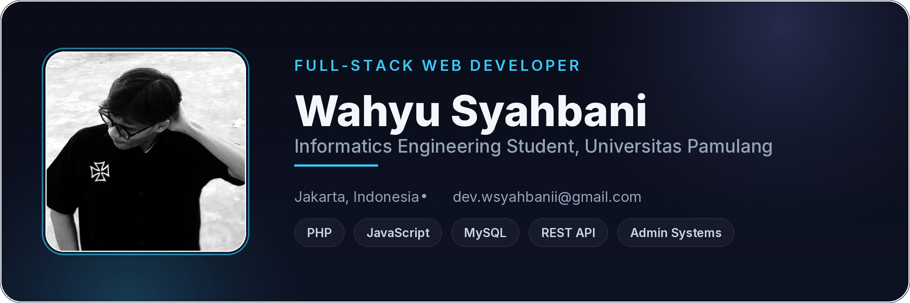

  <picture>
    <source media="(prefers-color-scheme: dark)" srcset="./assets/header-dark.png">
    <source media="(prefers-color-scheme: light)" srcset="./assets/header-light.png">
    
  </picture>

  
  
  
  

## About Me

I'm **Wahyu Syahbani**, an Informatics Engineering student at **Universitas Pamulang**, based in Jakarta, Indonesia. I build full-stack web applications, admin dashboards, desktop GUIs, and document generation tools.

Most of my hands-on work centers on shipping real, production-facing systems: a company website and admin dashboard with product variation logic, media pipelines, and live deployment, alongside personal projects exploring front-end interaction, game logic, and creative coding. I also work occasionally in graphic design, producing apparel and sublimation print layouts.

## Current Focus

| Area | What I'm exploring |
| --- | --- |
| **Full-Stack Web Development** | Vanilla JS front-ends, PHP + REST API backends, flat-file and relational data storage. |
| **Admin Systems & UX** | Dashboard usability, keyboard accessibility, modal/focus handling, and form validation. |
| **Deployment & Infrastructure** | cPanel/LiteSpeed hosting, SSL, `.htaccess` configuration, and Cloudinary media pipelines. |
| **Creative & Game Dev** | Browser-based interactive experiences, small games, and experimental front-end projects. |

## Featured Work

| Project | Focus | Why it matters |
| --- | --- | --- |
| [**Anakindo Company Website & Admin System**](https://www.anakindo.co.id) | Full-stack company platform | A production website and admin dashboard for PT. Anakindo Tangguh Perkasa, with PPN/TKDN fields, a variant/pricing system, WebP + Cloudinary media pipeline, and live cPanel deployment. |
| [**Personal Portfolio**](https://wsyahbanii.github.io) | Developer portfolio | A grey minimalist portfolio site with sticky-stack scroll sections, looping marquees, and a project gallery. |
| [**Graha Nisala**](https://wsyahbanii.github.io/chaos) | Experimental web experience | A creative front-end experiment exploring layout and interaction outside a standard portfolio format. |
| [**Void Booth**](https://wsyahbanii.github.io/capture) | Interactive capture app | A standalone booth-style web app built around media capture and interaction. |
| [**WARMER Pocket RPG: UNPAM**](https://wsyahbanii.github.io/warmer-pocket-rpg) | Browser-based game | A small browser RPG set around campus life at Universitas Pamulang, combining game logic with front-end skills. |
| [**Foto Kita Blur Trend**](https://wsyahbanii.github.io/assets/fotoKitaBlut.html) | Social trend recreation | A lightweight recreation of a popular photo-blur trend, built as a front-end experiment. |
| [**The Toilet**](https://wsyahbanii.github.io/toilet) | Micro web project | A playful, self-contained project used to experiment with UI interaction and humor. |

## Tech Stack

**Languages & Web**

  
  
  
  
  
  

**Data & Tooling**

  
  
  

## GitHub Activity

  <picture>
    <source media="(prefers-color-scheme: dark)" srcset="https://raw.githubusercontent.com/wsyahbanii/wsyahbanii/output/github-contribution-grid-snake-dark.svg">
    <source media="(prefers-color-scheme: light)" srcset="https://raw.githubusercontent.com/wsyahbanii/wsyahbanii/output/github-contribution-grid-snake.svg">
    
  </picture>

### Recent Activity

<!-- AUTO:ACTIVITY:START -->
_Activity will appear here after the update workflow runs._
<!-- AUTO:ACTIVITY:END -->

---

  Building full-stack systems, one deploy at a time.

